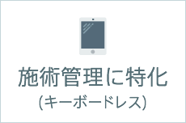
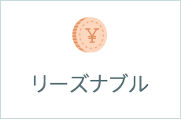
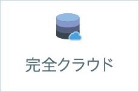

+++
aliases = []
title = "サロンカルテ"
authors = ["RYU"]
tags = []
+++

- [news](/salonkarte/news)
- [price](/salonkarte/price)
- [faq](/salonkarte/faq)
- [agree](/salonkarte/agree)

サロンカルテとは、美容室・ネイルサロン・アイラッシュサロンなどの各種サロン向けに開発された、
お客様の施術履歴を管理するためのカルテシステムです。
クラウドとスマホ・タブレットを主に開発したことにより、より安価により簡単に顧客管理が可能です。
顧客満足度の向上を図り、大切なお客様を定着利用していただく観点にフォーカスしたシステムです。

<section class="features-section py-5 text-center">
<h2 class="mb-5 text-primary fw-bold">4つの特徴</h2>

<!-- 特徴1 -->

<h5 class="fw-semibold">施術管理</h5>

手書きでOK。スマホで写真。 とにかく簡単操作！

<!-- 特徴2 -->

<h5 class="fw-semibold">リーズナブル</h5>

100件まで無料 年間15,000円で無制限！

<!-- 特徴3 -->

<h5 class="fw-semibold">完全クラウド</h5>

ハード不要 安全のバックアップ

<!-- 特徴4 -->

<h5 class="fw-semibold">マルチユーザー対応</h5>

複数スタッフの 同時利用もOK！

</section>

### その他の機能

パソコンとの連携ももちろんOKです。印刷したり、管理者がチェックしたり・・・使いなれたデバイスで操作できます。

  

    サロンカルテは、現場スタッフが簡単に使いこなせることを主に開発されました。 
    予約管理・売上げ管理・分析機能などを排除し管理者と現場スタッフの作業を分け、お客様とのコミュニケーションの最大値を発揮するアプリです。 
    これによりサロンへのファン層の定着が実現できます。
  

<section class="main-features-section py-5">

<h2 class="text-center text-primary fw-bold mb-5">主な特徴</h2>

<!-- 特徴1 -->

<h5 class="bg-dark text-white py-2">施術前・施術後の写真を管理</h5>



タブレットで写真をパシャッと撮影したら、そのままサロンカルテに利用できます。SDカードやケーブルで繋ぐ必要はありません。 
1枚のカルテにつき、写真・手書き・テキストが無制限に入ります。施術の前と後や、正面からと背面からの画像など、自由にお使いください。

<!-- 特徴2 -->

<h5 class="bg-dark text-white py-2">カルテ一覧</h5>



作成されたカルテは、1件につき1行のリストで表示され、タップすることで詳細なカルテを読むことができます。 
カルテは蓄積されていきますが、並べかえや絞り込みといった検索を使い、簡単に目的のカルテを見つけることができます。

<!-- 特徴3 -->

<h5 class="bg-dark text-white py-2">履歴の確認</h5>



カルテの一覧表示から、任意のカルテをタップするとカルテを読むことができます。

</section>

<h2 class="text-center text-primary fw-bold mb-5">データ移行について</h2>

### 顧客データの引っ越しをサポートします

今まで使っていた顧客管理システムから、今回サロンカルテに切り替えようと思った時に、１つの問題があります。
それは、これまで使ってきたシステムのデータを、どのようにしてサロンカルテに移動するかという点です。
結論から申し上げますと、顧客データの引っ越しは可能です。ただし、一部引っ越しが出来ないデータもあります。

<section class="py-5">

<!-- カード全体に高さを合わせるため d-flex & h-100 を使用 -->

<h5 class="card-title text-info border-bottom pb-2 fw-bold">取り込みが可能なデータ</h5>

以下のデータを取り込むことができます

<ul class="mb-0">
<li>顧客番号</li>
<li>顧客名・ふりがな</li>
<li>住所・郵便番号</li>
<li>生年月日</li>
<li>電話番号（固定・携帯）</li>
<li>メールアドレス</li>
</ul>

<h5 class="card-title text-info border-bottom pb-2 fw-bold">取り込みが不可能なデータ</h5>

以下のデータは、取り込むことができません。

<ul class="mb-0">
<li>画像データ</li>
<li>過去のカルテデータ</li>
<li>電子化されていないデータ</li>
</ul>

</section>

#### CSV形式で顧客データを取り込みます

お客様が現在ご利用中のデータを、サロンカルテで使えるように変換する必要があります。データベースの引っ越しには、CSV形式に変換し、データを整形する作業が必要になります。

データの取り込みに掛かる期間
データの受け渡しから、取り込みまで最短で3営業日ほどお時間が掛かります。
なお、この期間はスムーズにデータの受け渡しができた場合です。お預かりしたデータに整合性がなかったり、重複したデータが多数存在する場合、修正をご依頼することもあり、その場合、期間が更に伸びることになります。予めご了承ください。

データの取り込みに掛かる料金
基本料金が30,000円になり、一定量を超過すると、従量課金になります。

<table class="table table-striped table-bordered align-middle text-center">
<thead class="table-dark">
<tr>
<th scope="col">件数</th>
<th scope="col">料金</th>
</tr>
</thead>
<tbody>
<tr>
<td>300件まで</td>
<td>一律30,000円</td>
</tr>
<tr>
<td>300件を超過したデータ</td>
<td>1件あたり50円</td>
</tr>
</tbody>
</table>

別のシステムからデータを抽出し、サロンカルテに取り込むための料金です

例えば、1,000件の顧客データを取り込む場合、基本料30,000円の他に、(1,000件-300件)×50円= 35,000の料金が掛かります。

### 顧客データ取り込みまでの流れ

<section class="timeline-section py-5">

<!-- Step 1 -->

Step1.

<h5 class="fw-bold text-info">既存のデータベースからCSV形式で出力します</h5>

現在お使いの顧客管理システムでは、データベースの構造が異なるためそのまま取り込むことができません。 
そのため、一度CSVファイルに変換していただきます。 
CSVへの出力は、ご依頼者様ご自身で行っていただきます。

<!-- Step 2 -->

Step2.

<h5 class="fw-bold text-info">ご連絡ください</h5>

サロンカルテにデータを取り込む旨をお知らせ下さい。 
現在使用している顧客管理のシステム、取り込みたいデータの件数などをヒアリングさせていただきます。

<!-- Step 3 -->

Step3.

<h5 class="fw-bold text-info">CSVファイルを弊社まで送ってください</h5>

弊社にデータが届いた時点で、データの整形作業、取り込み作業を行います。 
顧客データに不整合な点（重複や桁の足りない郵便番号・電話番号など）について、必要に応じてご連絡します。

<!-- Step 4 -->

Step4.

<h5 class="fw-bold text-info">請求書を送付させていただきます</h5>

データが正常に取り込めたあとで、取り込んだデータ量に応じて、請求書を送付いたします。

</section>

### お預かりした個人情報の取り扱いについて

お客様からお預かりした、大切なお客様個人情報につきましては、弊社ガイドラインに則り、厳重に管理致します。
詳しくはプライバシーポリシーについてをご確認ください。

## サロンカルテ・レジ

サロンカルテの顧客データや施術履歴といったデータを、サロンカルテFIというレジシステムが連動します。

### レジから施術履歴が見れる

サロンカルテに残っているお客様の施術履歴が、レジからいつでも読めるようになりました。
前回の来店日からの経過日数を簡単に知ることができるので、例えば45日以内の再来店時は値引きするようなサービスをしている美容室さま・ネイルサロン様でもお使いになれます

### 複数の店舗を経営されている方へ朗報です

サロンカルテFIは他店舗経営者の強い味方です。
本店と支店の売上高を瞬時に合算することができるので、離れたお店の情報をいつでもリアルタイムに把握することができます

### サロンカルテを導入されていれば格安です

サロンカルテを導入されているサロン様へ、特別価格でレジをご提案させていただいております。
１店舗　年間使用料　5,000円（税別）です。
年間使用料　サロンカルテ（15,000円）＋レジ（5,000円）＝20,000円（税別）

店舗の売上が１箇所で確認できます。それも今、の売上もリアルタイムに反映されます。

### サロンカルテの顧客データが連動

サロンカルテに登録したお客様リストがそのままレジに表示されます。まさにサロンカルテ専用のレジシステムです。

### 便利なレジ機能

一般的なレジと異なり、クラウド上で管理するレジシステムです。クラウドならではのメリットが沢山あります。

<section class="py-5">

<!-- カード1 -->

生産性の管理

一人のお客様をとっても、シャンプーやカット、カラーなど様々な工程があります。 
各工程にポイントを付けることで、従業員の生産性を管理することができます。

<!-- カード2 -->

従業員のランキング

がんばった従業員はひと目でわかります。生産性の管理は、従業員のやる気を奮い起こす一つのきっかけになるはずです。

<!-- カード3 -->

フルマネージド

レジのデータバックアップは全自動です。 
面倒なバックアップ処理は不要です。

</section>
