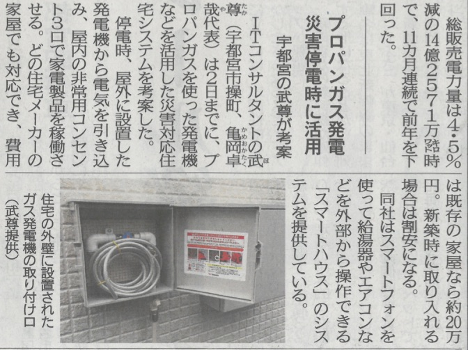

安心できるスマートハウス。

これは太陽光パネルの設置や蓄電池の導入よりも費用を抑えながらも最低限の電気が賄えるシステムです。

プロパンガス５０kgで１２０時間９００ワットを提供できます。

冷蔵庫　電灯　テレビ　携帯電話の充電　給湯器の電源（お風呂を沸かせます）

上記の家電は維持できます。

夏場の冷蔵庫が１日でも使えなければ、食品はすべて腐ってしまいます。

特に子供のいる家庭では深刻な問題です。

今後、災害等で電気の安定供給が阻害されることが想定されます。

この価格であれば安心を得るには安いのではないでしょうか。

普段はキャンプに持ち出すことも可能です。

これから家を建てる方、リフォームをしたい方ご相談ください。

