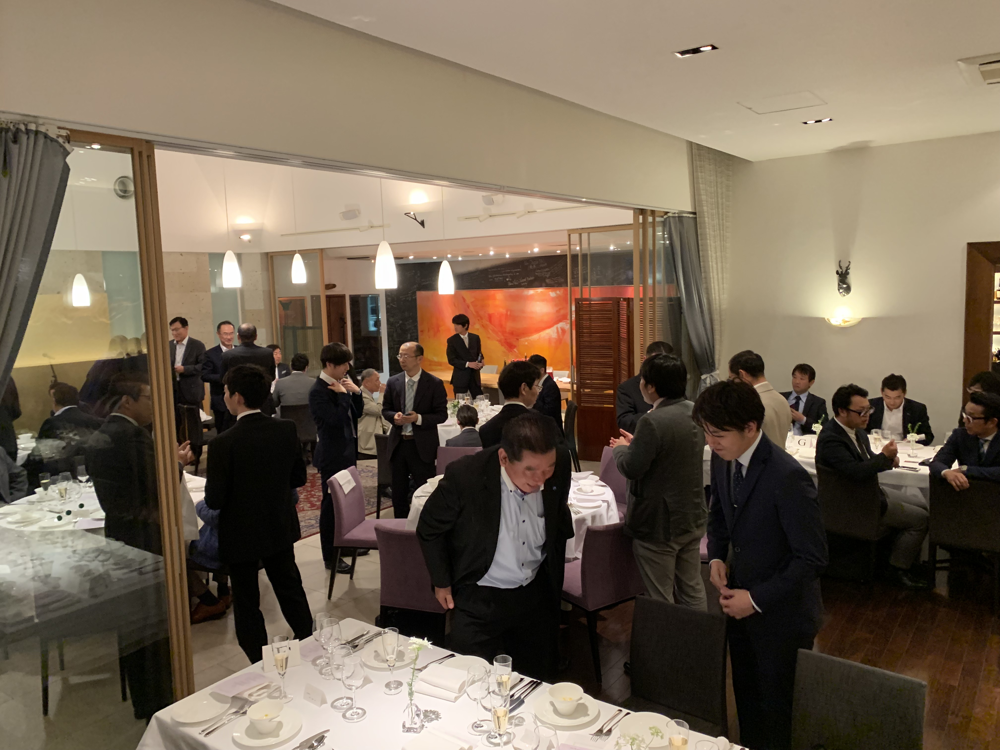

謹啓　早春の侯、時下ますますご清祥のことと心よりお慶び申し上げます。平素は格別のご高配を賜り厚くお礼申し上げます。  
さて、今年度も日頃お世話になっている方々への御礼と、相互の親睦を深めるための懇親会を開催いたしますのでご案内申し上げます。  
昨年開催の本会には、多方面でご活躍される方々にご来場賜り、活発な交流の場を設けることができました。誠にありがとうございました。  
今年は、より多くの方が交流し、新たなビジネス及び価値の創造の場としてまいりたいと考えております。  
つきましては、下記の要領で開催することといたしました。ご多用中とは存じますが皆様のご来場を心よりお待ち申し上げております。

謹白

記

日　時　：　平成３１年５月２２日（水）　午後６時３０分～

場　所　：　オトワレストラン

住　所　：　〒320-0826　栃木県宇都宮市西原町３５５４－７

電　話　：　０２８－６５１－０１０８ 

Ｈ　Ｐ　：　https://www.otowa-artisan.co.jp

【ご紹介のお願い】

業務分野を問わず、本会の趣旨にご興味をお持ちいただける経営者の方がお近くにいらっしゃいましたら、大変恐縮ではございますが、ご紹介いただけましたら幸甚でございます。

ご来場の皆様、ありがとうございました。

来年も開催いたしますので、新たなビジネスチャンスをご紹介頂ければ幸いです。

